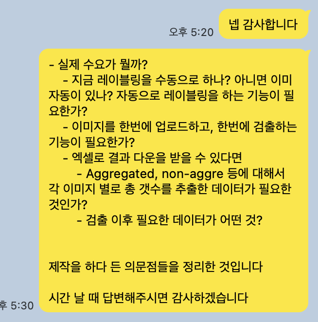
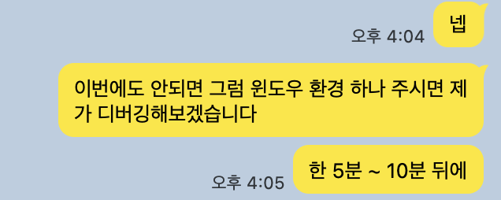

# 🔬 연구실 업무 자동화 툴 개발 · 납품
### 국립대 대학원 연구실 | 박테리아 응집 분류 자동화 데스크탑 앱

---

## 개요

국립대 대학원 화학 연구실에서 진행 중인 박테리아 실험의 **이미지 분석 업무를 자동화**하는 툴을 기획·개발·납품한 프로젝트입니다.

연구원들이 매 실험마다 **200장 이상의 현미경 이미지**를 육안으로 직접 확인하며 수동으로 카운팅하던 반복 노동을 식별하고, 이를 해소하는 도구를 **선제적으로 제안·제작**하여 연구 효율을 실질적으로 끌어올렸습니다.

> **기술 스택** : Python · YOLOv8 · Swin Transformer · OpenCV · Tkinter · PyInstaller · Antigravity ( FM )
> **납품 형태** : Windows 실행 파일 (`.exe`) 기반 데스크탑 애플리케이션

---

## 배경 및 문제 정의

### 인수인계 자료에서 병목을 발견했습니다

프로젝트 초기, 선행 연구자의 인수인계 자료를 검토하면서 연구실의 작업 흐름을 파악했습니다.

그 과정에서 **모델 학습에 필요한 레이블링 작업 전체가 수작업**으로 이루어지고 있다는 사실을 확인했습니다.

연구실은 오픈소스 GUI 도구인 **[LabelMe](https://github.com/wkentaro/labelme)** 를 사용해, 이미지 한 장 한 장을 열어 박테리아 개체마다 직접 바운딩 박스를 그리고, 응집 여부를 수동으로 태깅한 뒤 JSON으로 저장하고 있었습니다.

```
[기존 레이블링 워크플로우]
  이미지 열기 → 박테리아마다 박스 직접 그리기 → 응집 여부 수동 태깅
  → JSON 저장 → 반복 (200~300장)
```

> 모델 학습을 위한 데이터 준비 단계에서만 이미 **수백 장의 이미지를 사람이 일일이 처리**해야 하는 구조였습니다.

이 지점에서 핵심 질문이 생겼습니다.

> **"이 레이블링 자체를 자동화할 수 있다면, 모델 학습도 실사용도 훨씬 빨라지지 않을까?"**

이것이 단순한 분류 모델 구현을 넘어, **자동 레이블링 기능을 설계하고 도구 전체를 통합하는 방향**으로 나아가게 된 출발점입니다.

---

### 방향을 바꾼 한 마디

프로젝트 초반, 단 한 번 있었던 오프라인 미팅에서 연구원이 무심코 건넨 말이 있었습니다.

> *"직접 쓰는 걸 만들어주면 좋겠는데..."*

이 한 마디가 오래 머릿속에 맴돌았습니다.

모델의 정확도를 높이는 것도 중요하지만, 정작 연구원이 원하는 것은 **배경 지식 없이도 바로 쓸 수 있는 도구**였습니다.  
그때부터 방점이 바뀌었습니다. 이론적인 모델 성능 최적화에서, **비전공자가 별도 학습 없이 쓸 수 있는 UI와 워크플로우**를 설계하는 것으로.

이것이 단순한 ML 실험을 넘어 **데스크탑 애플리케이션 개발로 방향을 확장**하게 된 핵심 계기입니다.

---

### 수요를 직접 파악했습니다


연구실이 해결하고자 한 과제는 **박테리아의 응집 여부(Aggregated / Non-Aggregated)** 를 현미경 이미지에서 판별하고, 그 비율을 산출하는 것이었습니다.

기존 프로세스의 문제는 명확했습니다.

| 기존 방식 | 문제점 |
|---|---|
| LabelMe로 이미지마다 수동 레이블링 | 200~300장 처리에 과도한 시간·노동 투입 |
| 이미지 1장씩 육안 확인 후 카운팅 | 실험 1회당 최소 200장 처리 필요 |
| 수동 카운팅 후 엑셀 입력 | 사람 실수, 시간 낭비 |
| 결과 재확인 방법 없음 | 오류 수정 불가 |

직접 담당 연구원에게 3가지 핵심 질문을 던졌고, 그 답변을 토대로 기능 명세를 구성했습니다.

<p align="center">
  <br>
  <sub><em>그림 1) 제작 중 든 의문점 3가지를 직접 정리해 인터뷰를 진행한 장면</em></sub>
</p>

**실제 답변 (연구원 원문)**

> *"현재 저희가 따로 이미지에 레이블링을 하진 않습니다. 이미지를 눈으로 확인한 후 수동으로 한 이미지 속에 존재하는 대장균수와 응집을 보이는 대장균수를 각각 카운팅하여 엑셀에 카운팅한 값을 옮겨 적습니다."*
>
> *"실제로 저희가 하나의 실험군 당 최소 200장의 이미지를 촬영하기 때문에 한 장씩 업로드 하여 검출할 경우 분석 시간이 오래 걸리게 됩니다."*
>
> *"잘못 분류되었을 경우 그 부분을 사람이 직접 수정이 가능해야 합니다."*

이 수요 파악을 바탕으로 **기능 명세를 직접 정의**했습니다.

---

## 핵심 기능 설계

수요 인터뷰 결과와 인수인계 과정에서 파악한 병목을 바탕으로, **단순한 모델 구현이 아니라 레이블링부터 결과 산출까지 전 과정을 아우르는 워크플로우**를 직접 설계했습니다.

### 핵심 발상 : 레이블링 자동화

> 기존에는 LabelMe 툴로 수백 장의 이미지를 사람이 직접 열어 박스를 그리고 태깅해야 했습니다.  
> **이 과정을 OpenCV 기반 이미지 처리로 자동화**함으로써, 모델 학습 데이터 준비 비용을 크게 줄이고  
> 연구자가 결과를 검토·보정하는 역할만 남길 수 있다고 판단했습니다.

이는 단순히 "있으면 편한 기능"이 아니라, **수동 레이블링이라는 구조적 병목을 제거하는 핵심 설계 결정**이었습니다.

### 설계 원칙 : "반자동이라도 도움이 되면 된다"

> 완전 자동화가 아니면 의미 없다는 이분법적 사고를 지양했습니다.  
> 70%의 이미지를 자동 처리해주기만 해도 연구자의 수작업 부담은 크게 줄어듭니다.  
> 실질적 도움이 되는 도구를 빠르게 내놓고, 피드백으로 고도화하는 방향을 택했습니다.

### 구현된 주요 기능

```
[옵션 1] 자동 레이블링
  └─ 이미지 입력 → OpenCV 기반 박테리아 검출 → JSON 형식 레이블 자동 생성

[옵션 2] 분류 및 결과 추출
  └─ 이미지 + JSON → 머신러닝 모델 → Aggregated / Non-Aggregated 분류
  └─ 결과 이미지 일괄 저장
  └─ CSV 다운로드 (이미지명 / Aggregated 수 / Non-Aggregated 수 / 비율)

[옵션 3] 수동 보정 인터페이스
  └─ 분류 결과 이미지 내 바운딩 박스 직접 수정 가능
  └─ 수정 사항 집계 결과에 실시간 반영
```

---

## 진행 과정

### 초기 접근 및 모델 탐색

연구실 인수인계 자료를 검토하며 기존 시도 내역을 파악했습니다.

- `YOLOv8` → 약 80% 정확도 확인
- `YOLO + Classification` 조합 검토
- `Mask R-CNN` 적용 실험
- **`Swin Transformer` 기반 분류기**로 방향 정립

모델 성능보다 **데이터 품질이 결과를 결정**한다는 판단 하에, 라벨링 검수와 데이터 증강(회전, 반전 등으로 500장 이상 확장)에 집중했습니다.

---

### 2026-06-30 · 초기 버전 배포 및 수요 인터뷰

- 자동 레이블링 기능 1차 구현 완료
- 다중 이미지 처리 및 CSV 출력 구조 설계
- 실사용자(연구원)에게 3개 핵심 질문 인터뷰 실시 → 기능 명세 확정
- 레이블링 자동화 초기 버전 배포

> *자동 레이블링이 꽤 괜찮은 수준으로 동작함을 내부 검증으로 확인. 일부 뭉친 박테리아 처리 개선 필요.*

---

### 2026-07-01 · Windows 배포 문제와 직접 해결

**문제의 구조적 원인 파악**

개발 환경이 macOS였던 만큼, Windows 실행 파일(`.exe`) 배포 과정에서 예상치 못한 복합적 문제가 발생했습니다.

초기에는 오류가 생길 때마다 연구원에게 오류 내용을 받아 원격으로 수정 후 재전달하는 방식을 시도했습니다.  
그러나 이 방식은 구조적인 한계가 있었습니다.

```
[원격 디버깅 방식의 병목]
  1. 빌드 단계 오류 : .bat 파일로 Windows exe 빌드 중 오류 발생
  2. 빌드 성공 후에도 : 실행 파일 구동 시 또 다른 오류 발생
  3. 오류 확인 병목 : 연구원이 오류 메시지를 캡처해 전달 → 수정 → 재전달 반복
  4. 일정 충돌 : 양 측의 가용 시간이 맞지 않아 대기 시간 발생
```

> 오류 하나를 수정하면 다른 오류가 이어졌고, 매번 연구원의 확인과 전달이 필요해 흐름이 반복적으로 끊겼습니다.

**대안 검토 : 가상 환경 구성**

맥에서 Windows 환경을 구성하는 방법을 검토했습니다.

- 가상 머신(Virtual Machine) — 설치 용량 수십 GB, 환경 구성에 과도한 시간 소요
- Wine (Windows 에뮬레이터) — 맥에서 `.exe` 구동 테스트 가능하나, 빌드 자체는 불가
- **크로스 컴파일** — macOS에서 Windows용 `.exe`를 단일 파일로 생성하는 것은 PyInstaller 구조상 불가

어떤 방법도 빌드부터 실행까지의 전 과정을 맥에서 완결하기 어려웠습니다.

**결정 : 직접 Windows 환경으로 이동**

대안을 검토한 끝에 **학교 IT 실습실의 Windows 컴퓨터로 직접 이동해 작업**하는 방식을 선택했습니다.

<p align="center">
  <br>
  <sub><em>그림 2) 원격 접속도 한계가 있다고 판단, IT관으로 직접 이동하기로 결정한 장면</em></sub>
</p>

- Google Drive에 버전별 소스코드를 업로드
- Windows 환경에서 직접 다운로드 → 빌드 → 실행 테스트
- 성공한 버전을 즉시 Drive에 백업 후 연구원에게 전달

이 결정으로 **연구원이 오류 확인·전달에 개입해야 하는 병목이 완전히 제거**됐습니다.  
오류 수정 → 빌드 → 테스트의 전 사이클을 한 자리에서 완결할 수 있게 되어, 이후 기능 개선 속도도 함께 빨라졌습니다.

> 작은 결정이었지만, 협업 방식을 바꾼 핵심 전환점이었습니다.

---

### 2026-07-02 · 핵심 피벗 및 안정화

**기술 스택 피벗 : Streamlit(웹) → Tkinter(데스크탑 앱)**

웹 기반 구동 방식이 Windows 빌드 과정에서 지속적인 복잡성을 야기함을 인지하고, **Tkinter 기반 네이티브 앱으로 전환**했습니다.

이 결정의 핵심은 **진전의 누적**입니다.  
웹 방식은 코드 수정 시마다 빌드 이슈가 재발할 위험이 있었던 반면, Tkinter 전환 후에는 빌드 문제를 한 번 해결하면 이후 기능 개선에만 집중할 수 있었습니다.

- IT관 Windows 환경에서 직접 빌드 완료
- Google Drive를 통한 버전 관리 및 배포 파이프라인 구축
- 실행 파일 단독 구동 테스트 완료

---

### 2026-07-02 (2차) · 4가지 개선 과업 합의

Windows 안정화 직후, 실사용 회의에서 연구원이 직접 개선점을 제안했고, 이를 정리해 4가지로 합의했습니다.

> **연구원:**  
> *"배치 처리랑 대장균 인식률, 그리고 잘못 인식된 것을 유저가 수정할 수 있으면 좋을 것 같아요"*  
> *"우선 이 4개만 되면 될 것 같아요!"*

```
1. 자동 레이블링 고도화
   - 뭉친 박테리아 분리 검출 처리
   - 명도 낮은 이미지 검출 실패 케이스 개선

2. 분류 모델 정확도 향상
   - Aggregated / Non-Aggregated 판별 정밀도 개선

3. 사용자 직접 수정 UI 추가
   - 잘못된 바운딩 박스를 사용자가 직접 조정 가능하도록 구현

4. 결과 이미지 확대 확인 기능
   - 더블클릭 시 개별 이미지 페이지로 확인 가능

5. 파일 형식 확장
   - .png 외 .tiff / .tif 확장자 지원 추가
```

---

### 2026-07-03 · 핵심 알고리즘 개선

- 자동 레이블링 알고리즘 교체 : **CLAHE → Watershed**
  - Watershed 알고리즘 도입으로 뭉친 박테리아 군집을 개별 개체로 분리 검출
- 검출 결과 후처리 UI 추가 : 바운딩 박스 직접 수정 인터페이스 구현

---

## 배포 및 피드백 루프

### 2026-07-07 · 개선 버전 데모 영상 발송 후 실사용 반응

4가지 개선 사항을 적용한 실행 영상을 직접 찍어 연구원에게 발송했습니다.

> **연구원 (2026-07-07):**  
> *"완전 의도한 바와 일치합니다. 모델 정확도도 이전보다 상승한게 보여요..."*  
> *"진짜 너무 고생 많으셨어요"*

### 2026-07-27 · 실사용 후 장기 피드백

납품 이후 실험을 진행하면서 직접 툴을 쓴 연구원이 장기 피드백을 전달했습니다.

> **연구원 (2026-07-27):**  
> *"보내주신 프로그램은 아주 잘 작동됩니다! 개선점은...정확도 말고는 없습니다"*

> **2026-07-28 후속 인터뷰 후 추가 피드백:**  
> *"이 툴을 써서 작업할 것 같습니다"*  
> *"이미지 파일형식, 색상에 구애받지 않아 사용 방식에는 큰 불편이 없습니다."*

---

## 강점 및 차별점

### 1. 수요 선점형 접근

시키기 전에 먼저 수요를 파악하고, 기능 명세를 직접 정의했습니다.  
연구자가 "이런 게 필요한데 만들어줄 수 있나요?"가 아니라, **"이런 문제가 있을 것 같아서 먼저 만들어봤습니다"** 라는 방식으로 접근했습니다.

### 2. 실사용자 중심 설계

모델 정확도보다 **연구자가 실제로 매일 쓸 수 있는 도구**를 만드는 것을 우선했습니다.  
"수정 가능한 인터페이스"를 핵심 기능으로 넣은 것도 연구자의 답변에서 나온 요구사항이었습니다.

### 3. 병목 없는 납품 프로세스

고객 환경에서 디버깅을 요청하는 방식은 양 측의 일정 충돌로 인한 스트레스를 야기합니다.  
Windows 환경에서 빌드와 테스트를 **직접 완료한 후 전달**함으로써, 고객이 오류 리포팅에 개입해야 하는 상황을 최소화했습니다.

### 4. 점진적 개선 루프 구축

완성 이후에도 피드백 기반의 개선 과업을 직접 정의하고 우선순위를 매겨, **지속적인 품질 향상**이 가능한 구조를 만들었습니다.

---

## 결과

- 실험 1회당 200장 이상의 수동 분석 업무 자동화
- 연구원 직접 수정이 가능한 보정 UI로 **100% 자동화가 아니어도 실질 효용 확보**
- 응집 비율 CSV 자동 산출로 **엑셀 수작업 제거**
- 납품 후 석/박사 연구원 실사용 피드백 : *"보내주신 프로그램은 아주 잘 작동됩니다! 개선점은...정확도 말고는 없습니다"*
- 국립대 대학원 연구실 납품 실적

---

> 추후 실사용 화면 캡처 및 UI 스크린샷 추가 예정 (내부 허가 이후)
